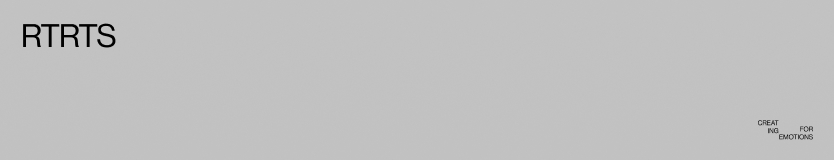

# retratS

#starteR template for React projects

## [Live Demo](https://retrats-template.vercel.app/)

### 'createdWith': {

```
 "@gsap/react": "^2.1.0",
  "@sanity/client": "^6.12.3",
  "classnames": "^2.5.1",
  "framer-motion": "^11.0.3",
  "gsap": "^3.12.5",
  "locomotive-scroll": "^5.0.0-beta.11",
  "react": "^18.2.0",
  "react-intersection-observer": "^9.7.0",
  "react-query": "^3.39.3",
  "react-router-dom": "^6.22.3",
  "sass": "^1.70.0"
```

### }
